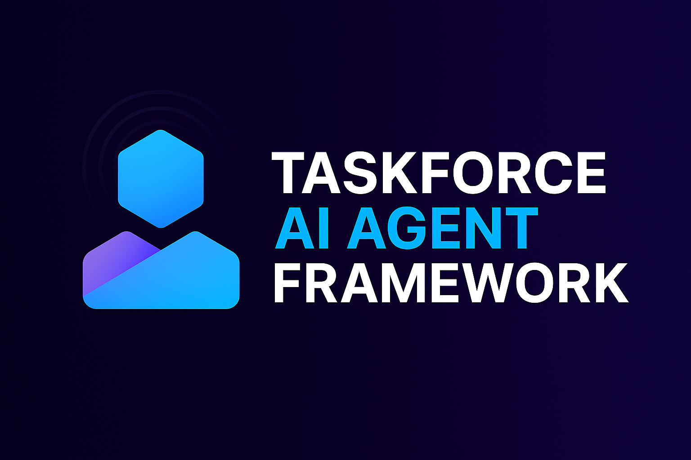

# 🚀 TaskForce AI Agent Framework

<p align="center">
  <a href="https://github.com/marcoaras/taskforce">
    
  </a>
  <a href="https://www.npmjs.com/package/taskforce-agent">
    
  </a>
  <a href="https://github.com/marcoaras/taskforce/blob/main/LICENSE">
    
  </a>
  <a href="https://github.com/marcoaras/taskforce/actions">
    
  </a>
  <a href="https://codecov.io/gh/marcoaras/taskforce">
    
  </a>
  <a href="https://github.com/marcoaras">
    
  </a>
  <a href="https://marcoaras.github.io/taskforce/">
  
</a>
</p>

**TaskForce** is a modular, open, and production-ready TypeScript framework for orchestrating LLM-powered autonomous AI agents, task pipelines, dynamic toolchains, RAG workflows, and memory/retrieval systems.  
It is designed for real-world use-cases such as document analysis, automation, agent collaboration, enterprise search, and more.

> **Docs:**  
> [Agents](./docs/en/agent.md) ・ [Tasks](./docs/en/task.md) ・ [Tools](./docs/en/tool.md) ・ [Built-in Tools](./docs/en/tool-list.md)  
> [Memory & Retrieval](./docs/en/memory.md) ・ [Fine-tuning](./docs/en/fine-tuning.md) ・ [TaskForce Core](./docs/en/taskForce.md)

---

<div align="center">



</div>

---

## ✨ Features

- **Multi-agent orchestration:** Hierarchical, sequential or fully AI-driven
- **Plug-and-play tools:** Web, file, API, vision, code, custom
- **Retrieval-Augmented Generation (RAG):** Chroma, Pinecone, LangChain, JSON, etc.
- **Extensible memory system:** Short/long, per-agent, global, persistent
- **Integrated fine-tuning:** OpenAI, HuggingFace, custom models
- **Advanced error handling, retry, delegation, logging**
- **Rich CLI, API, and UI integration ready**
- **Community-first, open source, production-ready**

---

## ⚡️ Getting Started

### 1. Install

```bash
npm install taskforce-agent
```

---

### 2. Configure `.env` (Recommended)

Create a `.env` file in your project root to enable all tool and memory features:

```dotenv
# General
VERBOSE="true"
EMITTING="true"
TELEMETRY_MODE="append" # append | overwrite | none

# API Keys
OPENAI_API_KEY="your-openai-key"
DEEPSEEK_API_KEY="your-deepseek-key"
BRAVE_API_KEY="your-brave-key"
SERPAPI_API_KEY="your-serpapi-key"

# AI Models
DEFAULT_AI_MODEL="gpt-4o-mini"
DEFAULT_MANAGER_MODEL="gpt-4o-mini"
DEFAULT_AI_SUMMARY_MODEL="gpt-4o-mini"

# Embedding
DEFAULT_EMBEDDING="huggingface"        # fake | openai | huggingface
DEFAULT_OPENAI_EMBEDING_MODEL="text-embedding-3-small"
HF_EMBEDDING_URL="http://localhost:1234/v1/embeddings"
HF_EMBEDDING_MODEL="sentence-transformers/all-MiniLM-L12-v2"

# Vector DB
CHROMA_URL="http://localhost:8000"
CHROMA_COLLECTION_NAME="agent_memory"
VECTOR_MEMORY_DB_PATH="./taskforce-db/memory.json"
```

> **Note:**
> Not all keys are required for all tools—just set the ones you need for your active toolset.
> You can add more (or fewer) according to your use-case!

---

### 3. Quick Example

```typescript
import {
  TaskForce,
  Agent,
  Task,
  DirectoryReadTool,
  BraveSearchTool,
  ExecutionMode,
} from "taskforce-agent";

// 1. Define agents
const researcher = new Agent({
  id: "researcher",
  name: "Market Researcher",
  goal: "Find up-to-date insights on AI trends",
  tools: [new BraveSearchTool(), new DirectoryReadTool()],
  memory: true,
});

const writer = new Agent({
  id: "writer",
  name: "Writer",
  goal: "Write a summary blog post based on research",
  tools: [],
});

// 2. Define tasks
const researchTask = new Task({
  id: "t1",
  description: "Research the latest AI trends",
  expected_output: "A list of 3 trending developments in AI",
  agent: "researcher",
});
const writeTask = new Task({
  id: "t2",
  description: "Write a markdown blog post summarizing research",
  expected_output: "A 4-paragraph markdown blog post",
  agent: "writer",
  inputFromTask: "t1",
});

// 3. Create TaskForce
const tf = new TaskForce({
  agents: [researcher, writer],
  tasks: [researchTask, writeTask],
  executionMode: ExecutionMode.AiDriven, // or "Hierarchical", "Parallel"
  verbose: true,
});

// 4. Run the workflow
await tf.run({ topic: "AI in 2025" });
```

---

## 🧠 Conceptual Overview

| Component     | Description                                                                                                                  |
| ------------- | ---------------------------------------------------------------------------------------------------------------------------- |
| **Agent**     | An LLM-powered persona with a role, tools, memory, and goals. ([details](./docs/en/agent.md))                                |
| **Task**      | A unit of work, assigned to an agent, with input/output and dependencies. ([details](./docs/en/task.md))                     |
| **Tool**      | A function, API, or skill agents can invoke (search, code, web, RAG, vision, etc). ([details](./docs/en/tool.md))            |
| **Memory**    | Vector memory, chat history, and RAG—per-agent or global. ([details](./docs/en/memory.md))                                   |
| **TaskForce** | The orchestrator managing agents, tasks, tools, execution, delegation, and coordination. ([details](./docs/en/taskForce.md)) |

---

## 🛠️ Tooling

> Tools are plug-and-play. Assign them to agents dynamically!
> See [built-in tools](./docs/en/tool-list.md) for all available options, advanced usage, and parameterized tool constructors.

**Popular Built-ins:**

- `BraveSearchTool` (web search)
- `DirectoryReadTool` (list files)
- `PDFSearchTool` (search in PDFs)
- `CSVSearchTool`, `MDXSearchTool`, `JSONSearchTool`, `DOCXSearchTool`, etc.
- `ScrapeElementFromWebsiteTool` (CSS selector-based web scraping)
- `DALLETool`, `StableDiffusionTool` (vision/generation)
- `GithubSearchTool`, `YoutubeChannelSearchTool`, `WikipediaSearchTool`
- `RagTool` (semantic/vector search via Chroma/Pinecone/JSON/...)
- **_Custom tools_**: Write your own in minutes!

```typescript
import { PDFSearchTool } from "taskforce-agent/tools";
const pdfTool = new PDFSearchTool();
```

---

## 🔗 Retrieval-Augmented Generation (RAG)

- Out-of-the-box support: Local/JSON, Chroma, Pinecone, LangChain, custom retrievers
- Integrates with agent memory, retrieval chains, and tools
- Multi-source and hybrid retrieval supported
- _[Learn more in retrieval.md](./docs/en/retrieval.md)_

---

## 🏗️ AI-Driven Planning & Orchestration

- `executionMode: AiDriven` lets the LLM break down tasks, assign agents, and choose execution mode
- **SmartManagerAgent** auto-created for planning and evaluation
- Advanced features: auto-chaining, context injection, result evaluation, replanning

---

## 🏛️ Memory System

- **Short-term memory:** Per-agent, in-memory vector store
- **Long-term memory:** JSON, ChromaDB, Pinecone, or custom backends
- **Auto-memory attach:** Use `memory: true` in agent/taskforce config
- **Scope:** Shared or per-agent for full flexibility
- _See [memory.md](./docs/en/memory.md)_

---

## 🎛️ Fine-Tuning Support

- Native support for OpenAI, HuggingFace, and custom models
- Simple API & CLI usage for fine-tuning and managing LLMs
- _See [fine-tuning.md](./docs/en/fine-tuning.md) & [openai-fine-tuning.md](./docs/en/openai-fine-tuning.md)_

---

## 🧩 Extending & Customizing

- Add custom agents, tools, memory providers, retrievers, evaluation logic
- All core classes designed for extension
- Plugin/registry APIs for community tool sharing

---

## 📚 Documentation & Resources

- [Agent Design](./docs/en/agent.md)
- [Task Design](./docs/en/task.md)
- [Tool System](./docs/en/tool.md)
- [Built-in Tool List](./docs/en/tool-list.md)
- [Memory & Retrieval](./docs/en/memory.md)
- [Fine-tuning](./docs/en/fine-tuning.md)
- [TaskForce Core](./docs/en/taskForce.md)
- [SmartManagerAgent](./docs/en/smartManagerAgent.md)

---

## ⚡️ Best Practices

- Prefer **AI-Driven execution** for flexible, scalable workflows
- Assign only agents—tasks and tools can be minimal for simple flows
- Use **TaskForce** for all but the smallest projects
- Build tools as reusable classes, leverage the registry
- Use RAG/memory for context-rich, robust agents

---

## 📝 Registering & Using Tools

```typescript
import { ToolRegistry, DirectoryReadTool } from "taskforce-agent";
ToolRegistry.register(new DirectoryReadTool(), "file", "built-in");
```

---

## 🚦 Roadmap

- [ ] End-to-end demo projects & best-practice docs
- [ ] UI/API layer, live orchestration, monitoring
- [ ] Plugin & community ecosystem
- [ ] Hybrid/multi-source RAG, advanced memory demos
- [ ] Test coverage, edge-case handling
- [ ] Dynamic prompt chaining, advanced AI-driven orchestration

---

## 🤝 Contributing

We welcome contributions! If you'd like to add a new tool, suggest a feature, or report a bug:

- Fork this repository and submit a pull request (PR)
- Open an [issue](https://github.com/your-repo-url/issues) for feedback or feature requests
- See [CONTRIBUTING.md](./CONTRIBUTING.md) for guidelines

---

## 📄 License

MIT © [TaskForce Contributors](https://github.com/marcoaras)  
_Created by [marcoaras](https://github.com/marcoaras)_

---

## 🗂️ Links

- [Full documentation in /docs](./docs/en/)
- [agent.md](./docs/en/agent.md) ・ [tool.md](./docs/en/tool.md) ・ [tool-list.md](./docs/en/tool-list.md) ・ [taskForce.md](./docs/en/taskForce.md)
- [task.md](./docs/en/task.md) ・ [memory.md](./docs/en/memory.md) ・ [retrieval.md](./docs/en/retrieval.md)
- [fine-tuning.md](./docs/en/fine-tuning.md)・ [openai-fine-tuning.md](./docs/en/openai-fine-tuning.md) ・ [smartManagerAgent.md](./docs/en/smartManagerAgent.md)

---

> _Contributions are welcome!_ For bug reports or suggestions, please open an issue or pull request.
